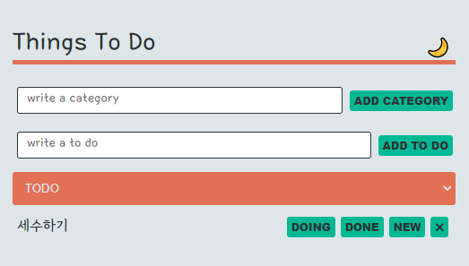

# Things To Do

## 개요

`React` `TypeScript` `styled-components` `recoil` `localstorage`

- 사용자가 원하는 카테고리에 따라 분류 가능한 ToDoList

## 기능

- 추가/삭제/카테고리변경이 가능한 ToDoList를 제공합니다.
- 사용자가 원하는 카테고리를 추가로 생성할 수 있습니다.
- 카테고리 별로 ToDo를 모아서 확인할 수 있습니다.
- 추가하고 싶은 카테고리에서 ToDo를 추가하면 해당 카테고리에 추가됩니다.
- 각 ToDo별 버튼을 통해 카테고리를 변경할 수 있습니다.
- 모든 아이템과 카테고리는 localstorage에 저장됩니다.
- 다크모드를 지원합니다.
